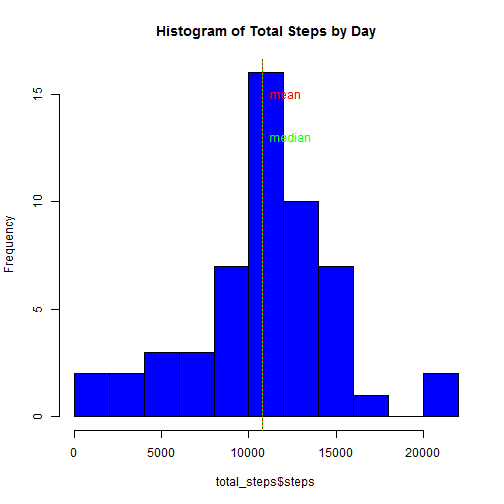
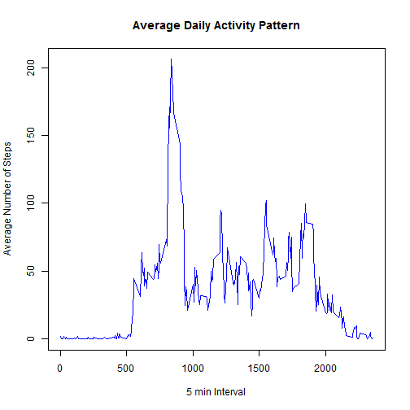
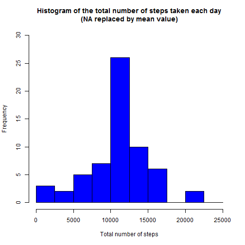
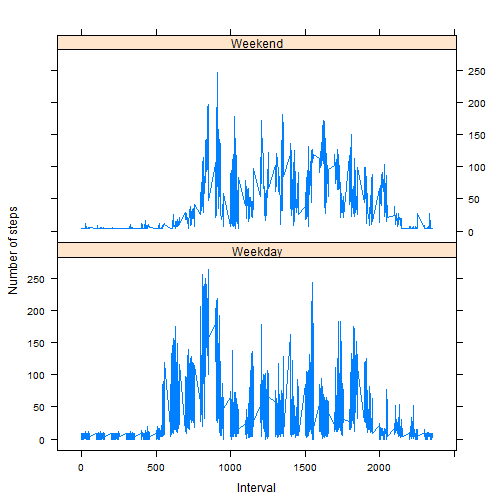

## Loading and preprocessing the data


```r
df <- read.csv("C:/Users/admin/Documents/GitHub/RR/activity.csv",header=T)
attach(df)
```

```
## The following objects are masked from df (pos = 3):
## 
##     date, interval, steps
## 
## The following objects are masked from df (pos = 4):
## 
##     date, interval, steps
## 
## The following objects are masked from df (pos = 5):
## 
##     date, interval, steps
## 
## The following objects are masked from df (pos = 6):
## 
##     date, interval, steps
## 
## The following objects are masked from df (pos = 7):
## 
##     date, interval, steps
## 
## The following objects are masked from df (pos = 8):
## 
##     date, interval, steps
## 
## The following objects are masked from df (pos = 9):
## 
##     date, interval, steps
## 
## The following objects are masked from df (pos = 10):
## 
##     date, interval, steps
## 
## The following objects are masked from df (pos = 11):
## 
##     date, interval, steps
## 
## The following object is masked from mean_data (pos = 13):
## 
##     interval
## 
## The following objects are masked from df (pos = 15):
## 
##     date, interval, steps
## 
## The following objects are masked from copy_df (pos = 16):
## 
##     date, interval, steps
## 
## The following objects are masked from copy_df (pos = 18):
## 
##     date, interval, steps
## 
## The following objects are masked from df (pos = 19):
## 
##     date, interval, steps
## 
## The following objects are masked from df (pos = 20):
## 
##     date, interval, steps
## 
## The following objects are masked from df (pos = 21):
## 
##     date, interval, steps
## 
## The following objects are masked from df (pos = 22):
## 
##     date, interval, steps
## 
## The following objects are masked from df (pos = 23):
## 
##     date, interval, steps
```

```r
head(df,10)
```

```
##    steps       date interval
## 1     NA 2012-10-01        0
## 2     NA 2012-10-01        5
## 3     NA 2012-10-01       10
## 4     NA 2012-10-01       15
## 5     NA 2012-10-01       20
## 6     NA 2012-10-01       25
## 7     NA 2012-10-01       30
## 8     NA 2012-10-01       35
## 9     NA 2012-10-01       40
## 10    NA 2012-10-01       45
```

## What is mean total number of steps taken per day?


```r
total_steps <- aggregate(steps~date,df,sum,na.rm=TRUE)

hist(total_steps$steps,main="Histogram of Total Steps by Day", breaks = 10,col = "blue")
    
abline(v = mean(total_steps$steps),col = "red",lty = 1)
abline(v = median(total_steps$steps),col = "green",lty = 3)
text(mean(total_steps$steps),15,labels = "mean",pos = 4,col = "red")
text(median(total_steps$steps),13,labels="median", pos=4, col="green") 
```

 

```r
mean_steps <- mean(total_steps$steps)
median_steps <- median(total_steps$steps)
print(mean_steps)
```

```
## [1] 10766.19
```

```r
print(median_steps)
```

```
## [1] 10765
```


## What is the average daily activity pattern?


```r
tseries <- aggregate(steps~interval,df,mean,na.rm=TRUE)
```

```
## Error in get(as.character(FUN), mode = "function", envir = envir): object 'FUN' of mode 'function' was not found
```

```r
names(tseries)
```

```
## [1] "interval" "steps"
```

```r
str(tseries)
```

```
## 'data.frame':	288 obs. of  2 variables:
##  $ interval: int  0 5 10 15 20 25 30 35 40 45 ...
##  $ steps   : num  1.717 0.3396 0.1321 0.1509 0.0755 ...
```

```r
summary(tseries)
```

```
##     interval          steps        
##  Min.   :   0.0   Min.   :  0.000  
##  1st Qu.: 588.8   1st Qu.:  2.486  
##  Median :1177.5   Median : 34.113  
##  Mean   :1177.5   Mean   : 37.383  
##  3rd Qu.:1766.2   3rd Qu.: 52.835  
##  Max.   :2355.0   Max.   :206.170
```

```r
plot(tseries$interval,tseries$steps,col = "blue",type="l",xlab = "5 min Interval",ylab = "Average Number of Steps",main = "Average Daily Activity Pattern")
```

 

```r
tseries$interval[tseries$steps == max(tseries$steps)]
```

```
## [1] 835
```

## Imputing missing values


```r
NAs <- function(x) {
    as.vector(apply(x, 2, function(x) length(which(is.na(x)))))
    }
sprintf("Total no of NA in Steps are %i ",NAs(df[1]))
```

```
## [1] "Total no of NA in Steps are 2304 "
```

```r
sprintf("Total no of NA in date are : %i",NAs(df[2]))
```

```
## [1] "Total no of NA in date are : 0"
```

```r
sprintf("Total no of NA in interval are : %i",NAs(df[3]))
```

```
## [1] "Total no of NA in interval are : 0"
```

```r
sprintf("Total no of rows with NA: %i",NAs(df[1]))
```

```
## [1] "Total no of rows with NA: 2304"
```

```r
index <- which(is.na(df$steps))


avg_vector <- rep(mean(df$steps, na.rm=TRUE), times=length(index))
df[index, "steps"] <- avg_vector

copy_df <- df

rm(avg_vector, index)
sum_aggregate <- aggregate(df$steps, by=list(df$date), FUN=sum)


names(sum_aggregate) <- c("date", "total")
hist(sum_aggregate$total, 
     breaks=seq(from=0, to=25000, by=2500),
     col="blue", 
     xlab="Total number of steps", 
     ylim=c(0, 30), 
     main="Histogram of the total number of steps taken each day\n(NA replaced by mean value)")
```

 

```r
x <-mean(sum_aggregate$total)
y <- median(sum_aggregate$total)
sprintf("Revised mean and median adter imputing NAs are %f",round(x,0))
```

```
## [1] "Revised mean and median adter imputing NAs are 10766.000000"
```

```r
sprintf("Revised mean and median adter imputing NAs are %f",round(y,0))
```

```
## [1] "Revised mean and median adter imputing NAs are 10766.000000"
```

## Are there differences in activity patterns between weekdays and weekends?


```r
copy_df$weekdays <- weekdays(as.Date(copy_df$date))

#levels(copy_df$weekdays)
#str(copy_df)
#table(copy_df$weekdays)

copy_df$date <- as.Date(copy_df$date,'%Y-%m-%d') 

copy_df$Day<- as.factor(ifelse(weekdays(copy_df$date) %in% c("Saturday","Sunday"),"Weekend","Weekday"))

mean_aggregation <- aggregate(copy_df$steps, 
                       by=list(copy_df$Day, 
                               copy_df$weekdays, copy_df$interval), mean)

# Rename the attributes
names(mean_aggregation) <- c("day", "weekday", "interval", "mean")

class(mean_aggregation)
```

```
## [1] "data.frame"
```

```r
library(lattice)
xyplot(mean_aggregation[,4] ~ mean_aggregation[,3] | mean_aggregation[,1], mean_aggregation, 
       type="l", 
       lwd=1, 
       xlab="Interval", 
       ylab="Number of steps", 
       layout=c(1,2))
```

 
